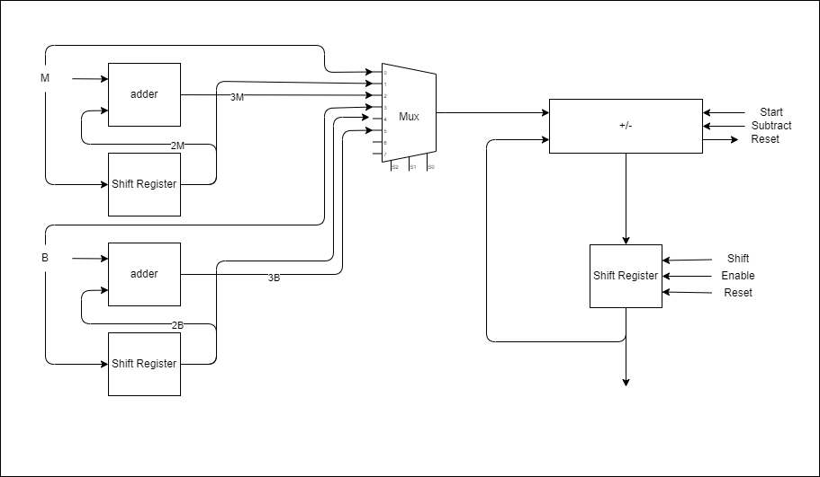
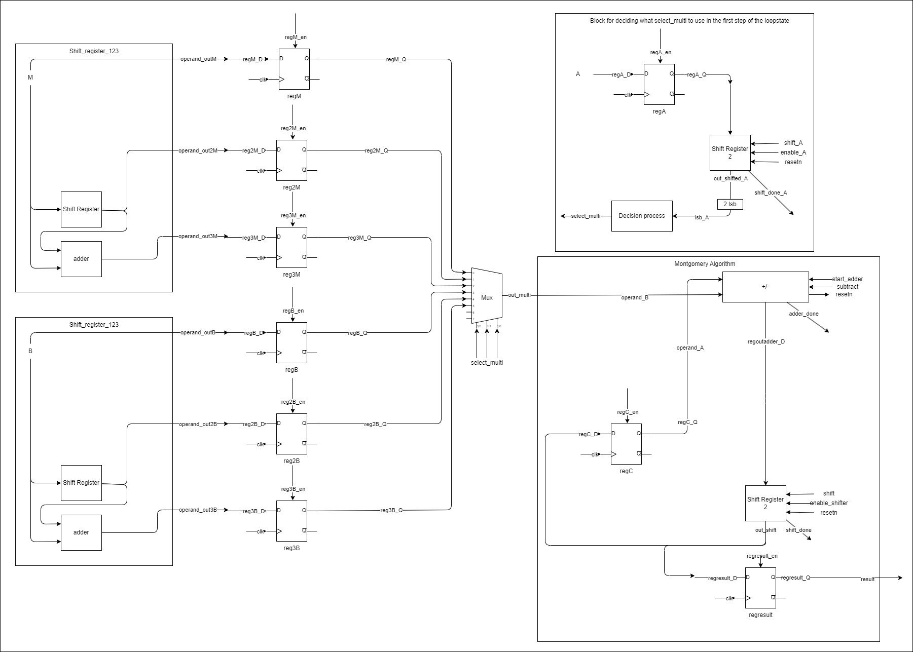
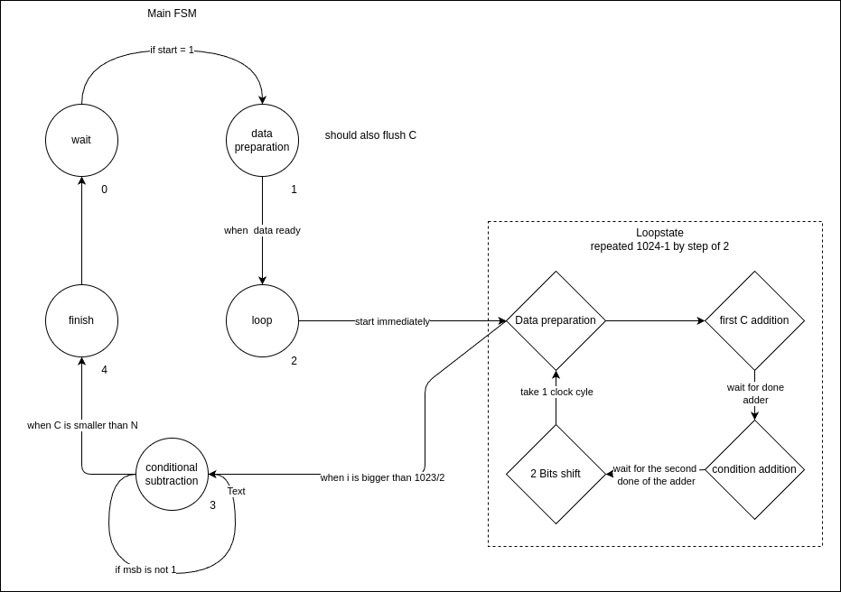

# Montgomery Multiplication

Go to the [adder](/adder) folder

I think the state 7 is not quite ready yet 

| Width | Cycle |  WNS  | Slice LUTS | Slice Registers |
| :---: | :---: | :---: | :--------: | :-------------: |
|  257  |   4   | 0.474 |    2530    |      3118       |
|  64   |  18   | 2.302 |    2139    |      3185       |

